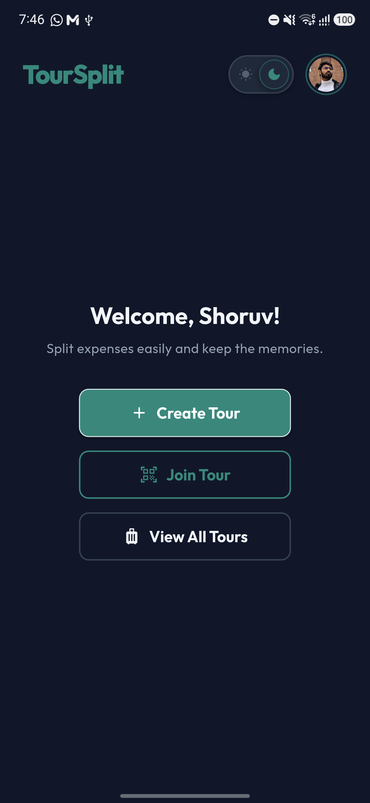
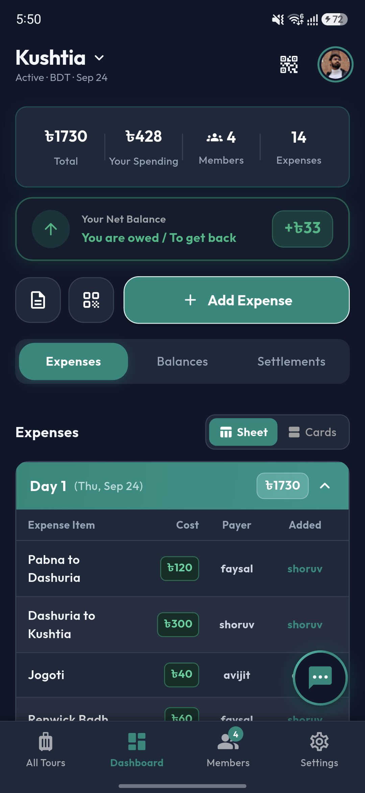
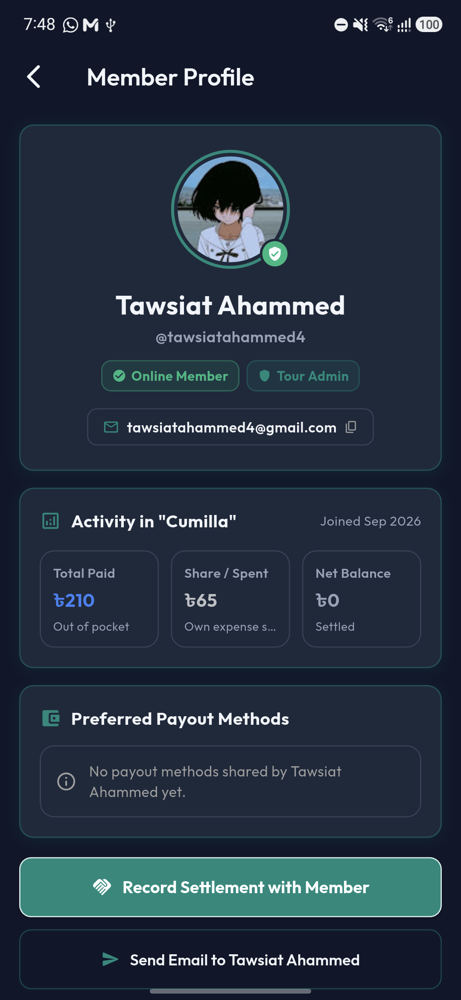
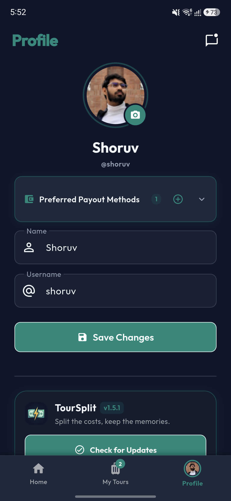
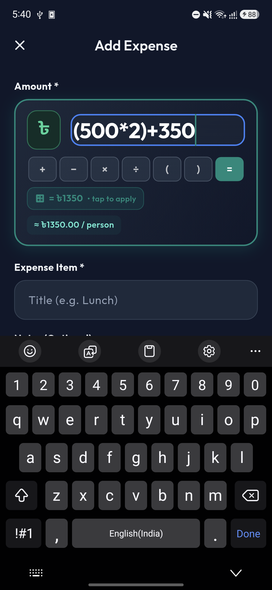
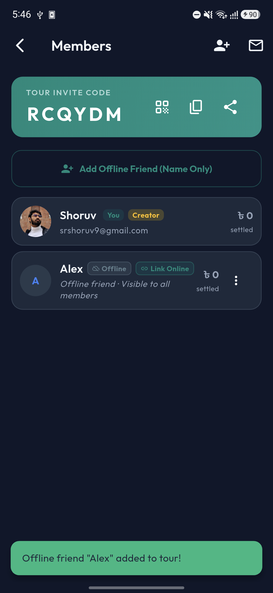
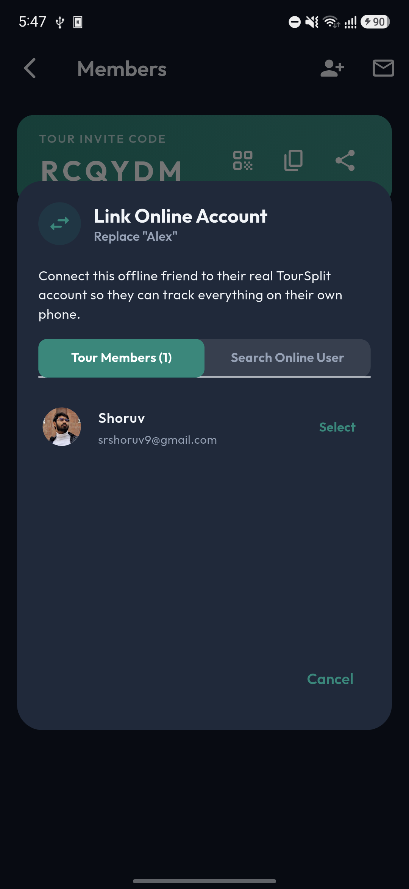
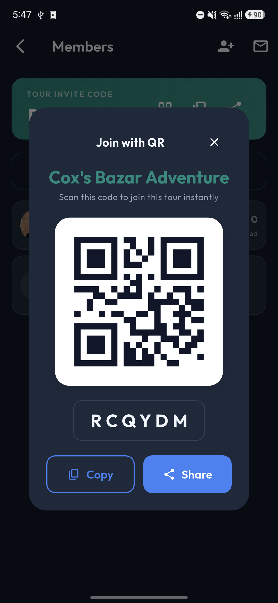

# TourSplit

<div align="center">

[](https://github.com/shoruvx/TourSplit/releases)
[](https://flutter.dev)
[](https://firebase.google.com)
[](https://github.com/shoruvx/TourSplit/releases)
[](LICENSE)

**Split the costs, keep the memories.**

A smart, real-time travel expense tracker and debt settlement app built for real trips with real people.

[Download Latest APK](https://github.com/shoruvx/TourSplit/releases/latest) • [Privacy Policy](https://shoruvx.github.io/TourSplit/) • [Report Bug](https://github.com/shoruvx/TourSplit/issues)

</div>

---

## Why TourSplit?

Anyone who has traveled with a group knows the drill: multiple people pay for cabs, hotel bookings, groceries, and late-night snacks. By day three, you're stuck in a nightmare of napkins, notes apps, and spreadsheet formulas trying to figure out who owes who.

**TourSplit takes care of all that instantly.** Log bills as they happen, do quick math right inside the amount box, add friends even if they don't have the app yet, and let TourSplit calculate the minimum number of payments to settle up at the end.

---

## Screenshots (Live on Device)

<div align="center">

### Modern Interface & Member Experience

| Symmetrical Home | Tour Dashboard | Member Profile | What's New & Updates |
|:---:|:---:|:---:|:---:|
|  |  |  |  |

<br/>

### Expense Splitting & Management

| In-Line Math Split | Offline Companions | Link Online Account | Tour QR Invite |
|:---:|:---:|:---:|:---:|
|  |  |  |  |

</div>

---

## Features

### Member Profile Exploration & Activity Hub
- Tap any member's avatar or name anywhere it appears (daily ledger, balances, settlement lists, members manager) to open their dedicated **Member Profile Screen**.
- View their exact out-of-pocket spending, individual expense share, and current net settlement balance for the active tour.
- Inspect their preferred payout methods (bKash, Nagad, Rocket, Bank) and send them an email with one tap.

### In-Line Math Calculator
No need to switch back and forth to your calculator app. When splitting a bill, type formulas directly into the amount box:
- Enter expressions like `(500 * 2) + 350` or `1200 / 3 + 50`.
- See a live glowing evaluation preview chip (`= ৳1350`).
- Tap the preview chip or click anywhere to auto-convert the expression into the final sum.
- Includes a dedicated quick arithmetic keypad (+, -, *, /, parentheses) right above your keyboard.

### Offline Companions & Instant Online Migration
Traveling with friends who don't have the app installed or have poor network reception?
- **Add Offline Friends**: Add companions with just their name in two seconds—no account or device required.
- **Track Normally**: Split bills, assign payers, and track balances for offline friends just like any member.
- **Instant Auto-Settlement**: Settle balances with offline friends automatically without requiring approval from the offline member.
- **Link When Ready**: When your friend installs TourSplit and joins the tour, tap **Link Online**. TourSplit migrates their entire transaction history, shared splits, and balance sheet to their real account with zero loss of data. Once online, standard approvals apply.

### 3D Teal Aesthetic & Adaptive System Theme
- Modern cards with sleek teal borders and soft 3D elevations.
- Outlined primary teal buttons with clean white borders for maximum contrast and visual appeal.
- Seamless dark and light modes with system default theme support.
- Fully symmetrical layouts across home, tour dashboards, and member directories.

### Contact Us & Suggestion Portal
- Send feature requests, suggestions, and feedback directly to the development team.
- Pre-filled device diagnostics and direct mail client integration.

### What's New Interactive Guide
- Discover newly released features, enhancements, and bug fixes right inside the app whenever a new version is installed.

### Greedy Debt Simplification
Instead of everyone transferring small amounts back and forth:
- TourSplit runs a **two-pointer greedy debt reduction algorithm** to collapse multi-party debts into the absolute minimum number of payments.
- Directly approve settlements, record payment channels (bKash, Nagad, Cash, Bank Transfer), and maintain an unalterable audit log.

### Collapsible Daily Ledger
- Group expenses chronologically by day (Day 1, Day 2, Day 3...).
- Keep days collapsed for a clean summary or expand any day to inspect individual line items.
- Supports multi-payer bills (e.g., Alice paid ৳2,000 and Bob paid ৳1,500 on the same hotel invoice).
- Split equally, split with selected companions, or enter custom exact share amounts.

### Real-Time Profile Avatars
- Express yourself on the group ledger with customizable profile photos.
- Pick pictures from your phone gallery, take a fresh selfie with your camera, or choose from travel-themed avatars.
- Updates broadcast instantly in real-time across all tour member screens.

### PDF Export & Reports
- Export professional, itemized accounting reports with a single tap.
- Download or print ready-to-share summaries of tour statistics, member contributions, and final balances.

### Seamless Over-The-Air (OTA) Updates & Background Push Notifications
- TourSplit connects directly with GitHub Releases to check for updates.
- Download and install newer versions directly inside the app with a friendly progress banner.
- High-priority background update notifications via Firebase Cloud Messaging ensure you never miss a new release even when the app is closed.

---

## Quick Start

### 1. Grab the APK
Download the latest Android release from the **[Releases Page](https://github.com/shoruvx/TourSplit/releases/latest)**.

### 2. Sign In
Log in with your Google account or email.

### 3. Create or Join a Tour
- **Create Tour**: Give your trip a name, select dates, pick a cover theme, and start logging.
- **Join Tour**: Scan the tour QR code or enter the 6-digit invite code (e.g., `RCQYDM`).
- **Navigation Tip**: Tap the tour title at any time to browse all your trips, or tap Back to return to the clean home screen.

---

## Developer Setup

If you want to contribute, build from source, or customize TourSplit for your own trips:

### Prerequisites
- [Flutter SDK](https://flutter.dev) (v3.3.0 or higher)
- Android SDK (API 34+)
- A Firebase project with Authentication (Google Sign-In) and Cloud Firestore enabled

### Getting Started

```bash
# 1. Clone the repo
git clone https://github.com/shoruvx/TourSplit.git
cd TourSplit

# 2. Fetch packages
flutter pub get

# 3. Add your Firebase config
# Place your `google-services.json` inside android/app/

# 4. Launch on an Android device or emulator
flutter run
```

### Building Release APK

```bash
flutter build apk --release
# Output: build/app/outputs/flutter-apk/app-release.apk
```

---

## Project Architecture

```
TourSplit/
├── android/                  # Native Android configuration & signing keystores
├── docs/                     # Live app screenshots & GitHub Pages assets
├── lib/
│   ├── core/                 # Theme tokens, route declarations, constants
│   ├── data/                 # Firestore repositories, data models & services
│   │   ├── models/           # TourModel, ExpenseModel, SettlementModel, UserModel
│   │   ├── repositories/     # Tour, Expense, Settlement, User repositories
│   │   └── services/         # AppUpdateService, AuthService, BalanceService
│   ├── presentation/         # Riverpod-powered UI screens & components
│   │   ├── auth/             # Login, Registration, Password Reset
│   │   ├── expense/          # Add/Edit Expense, Math amount input, Ledger views
│   │   ├── home/             # 3-Card Home, Tour Dashboard, Settlements
│   │   ├── profile/          # Profile screen, Avatar bottom sheet, Contact Us
│   │   ├── reports/          # PDF export & printable expense summaries
│   │   ├── tour/             # Create, Join (Code/QR), Settings, Member linking
│   │   └── widgets/          # Shared components, badges, dialogs
│   └── main.dart             # App entry point, Firebase & Hive initialization
├── pubspec.yaml              # App configuration & dependencies
└── README.md                 # Project documentation
```

---

## License

TourSplit is open source under the [MIT License](LICENSE). Feel free to use, modify, and distribute it.

<div align="center">

Crafted by **[Constant Time Labs](mailto:talktosrshoruv@gmail.com)** & **[Shoruv](https://github.com/shoruvx)**

</div>
