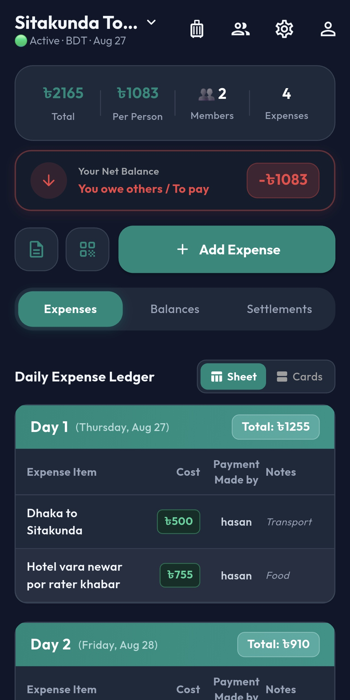
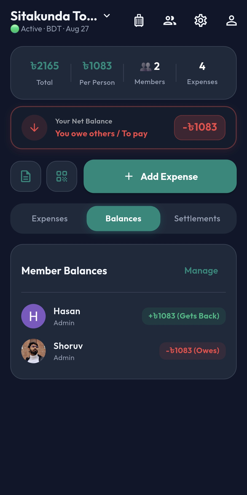
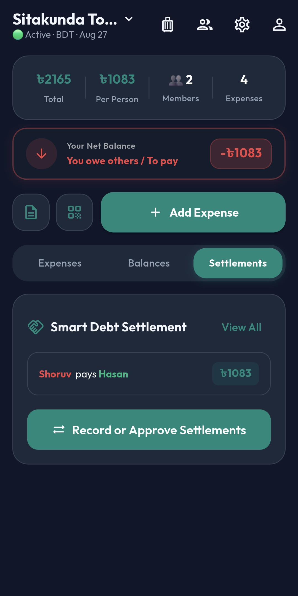
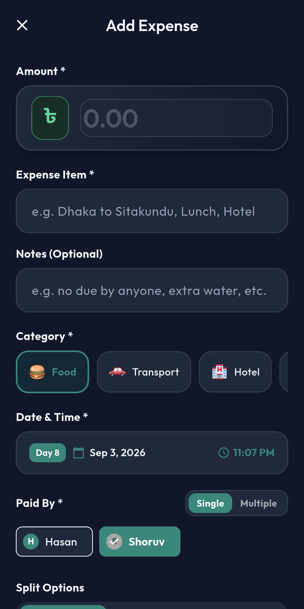

# 🗺️ TourSplit

<div align="center">

[](https://github.com/shoruvx/TourSplit/releases)
[](https://flutter.dev)
[](https://firebase.google.com)
[](https://github.com/shoruvx/TourSplit/releases)
[](LICENSE)

**"Split the costs, keep the memories."**

A modern, real-time group travel expense tracker and debt settlement app built with Flutter and Firebase.

[Download Latest APK](https://github.com/shoruvx/TourSplit/releases/latest) • [Privacy Policy](https://shoruvx.github.io/TourSplit/) • [Report Bug](https://github.com/shoruvx/TourSplit/issues)

</div>

---

## 📖 Overview

**TourSplit** eliminates awkward money conversations and chaotic spreadsheet calculations during trips. Designed specifically for travel groups, roommates, and holiday squads, TourSplit provides real-time expense synchronization, collapsible daily ledgers, multi-contributor expense logging, and an intelligent debt simplification engine that calculates the absolute minimum number of payments needed to settle all accounts.

---

## 🎯 Who Is This For?

- 🎒 **Travel Squads & Backpackers**: Share transport, food, lodging, and tickets effortlessly across multi-day trips.
- 🎓 **University & College Tour Batches**: Manage big-group tours with clear accountability and admin controls.
- 🏠 **Roommates & Mess Management**: Split shared groceries, utilities, and daily meals without disputes.
- 🚗 **Road-Trippers & Weekend Getaways**: Fast 6-digit invite code or QR scan lets everyone join in seconds.

---

## ✨ Key Features

### 🗺️ Instant Tour Management
- **One-Tap Join**: Enter a 6-character code or scan a tour QR code to join and jump straight into the tour dashboard.
- **Multiple Tours**: Switch seamlessly between active adventures and archived past tours.
- **Admin Delegation**: Tour creators can appoint co-admins to edit expenses, approve settlements, and manage members.
- **Safety First**: Double-confirmation safeguards for tour completion and permanent deletion.

### 💸 Dynamic Daily Expense Ledger
- **Collapsible Day Tables**: Chronological day-by-day expense breakdown (Day 1, Day 2, etc.) that stays collapsed by default for a clutter-free view.
- **Dual View Modes**: Switch between high-density **Sheet View** (spreadsheets) and modern **Card View**.
- **Multi-Payer Support**: Log expenses where multiple people contributed different amounts to a single bill.
- **Flexible Splitting**: Divide equally among all members, split only with selected participants, or define custom exact amounts.

### 🤝 Smart Debt Settlement
- **Minimum Transaction Algorithm**: Uses a two-pointer greedy balance simplifier to collapse complex webs of debt into the fewest possible payments.
- **One-Tap Settle**: Direct **"Settle"** buttons on debt cards allow instant settlement recording with custom payment notes (bKash, Cash, Bank).
- **Approval Workflow**: Settlements can be marked for review or approved on the spot by admins and recipients.
- **Complete Audit Trail**: Historical log of all settled, pending, and rejected payments.

### 🔒 Enterprise-Grade Security & Offline Cache
- **Google Sign-In**: Secure, passwordless authentication.
- **Firestore Cloud Rules**: Strict access control ensuring only authorized members can read and update tour data.
- **Offline Resilience**: Hive local caching keeps your tour data visible even in remote areas without internet connectivity.

### 🔄 In-App Remote Updates
- **Automatic Version Checks**: Connects directly to GitHub Releases API to detect new versions.
- **Silent Background Download**: In-app progress indicator and instant package installation when updates are published.

---

## 📱 Screenshots

| Home Dashboard | Collapsible Ledger | Debt Settlements | Add Expense |
|:---:|:---:|:---:|:---:|
|  |  |  |  |

---

## 🚀 Installation & Getting Started

### For Users (Android)

1. Head to the **[Latest Release](https://github.com/shoruvx/TourSplit/releases/latest)** page.
2. Download `TourSplit.apk`.
3. Open the downloaded file on your Android device and tap **Install** (allow "Install from Unknown Sources" if prompted).
4. Sign in with your Google account and you're ready to go!

---

### For Developers

#### Prerequisites
- Flutter SDK `>= 3.3.0`
- Android Studio / VS Code with Flutter extension
- Firebase project with Authentication (Google Sign-In) and Cloud Firestore enabled

#### Setup Instructions

```bash
# 1. Clone the repository
git clone https://github.com/shoruvx/TourSplit.git
cd TourSplit

# 2. Install dependencies
flutter pub get

# 3. Add Firebase Configuration
# Place your `google-services.json` in android/app/

# 4. Run the app on your connected device
flutter run
```

#### Build Release APK

```bash
flutter build apk --release
# Output will be generated at: build/app/outputs/flutter-apk/app-release.apk
```

---

## 🏗️ Architecture & Tech Stack

```
TourSplit/
├── android/                  # Android native project and Gradle scripts
├── docs/                     # GitHub Pages privacy policy & promotional assets
├── lib/
│   ├── core/                 # App constants, custom theme, and GoRouter routing
│   │   ├── constants/
│   │   ├── routing/
│   │   └── theme/
│   ├── data/                 # Data layer: Firestore repositories, models, and services
│   │   ├── models/           # Tour, Expense, Settlement, and User models
│   │   ├── repositories/     # TourRepo, ExpenseRepo, SettlementRepo
│   │   └── services/         # AuthService, BalanceService, AppUpdateService
│   ├── presentation/         # Presentation UI layer with Riverpod state management
│   │   ├── auth/             # Login, Register, Forgot Password
│   │   ├── balance/          # Balances & breakdown
│   │   ├── expense/          # Add expense, edit, details, DaySummaryTable
│   │   ├── home/             # Main Tour Dashboard, ledger, settlements tab
│   │   ├── profile/          # User profile & settings
│   │   ├── reports/          # PDF export & analytics
│   │   ├── tour/             # Create tour, Join tour, Tour settings, Members
│   │   └── widgets/          # Reusable UI widgets & FirstTimeGuideDialog
│   └── main.dart             # App entrypoint with Firebase & Hive initialization
├── pubspec.yaml              # Flutter dependencies and assets
└── README.md                 # Project documentation
```

- **Framework**: [Flutter](https://flutter.dev) (Dart)
- **State Management**: [Riverpod 2.x](https://riverpod.dev)
- **Navigation**: [GoRouter](https://pub.dev/packages/go_router)
- **Backend / Database**: [Cloud Firestore](https://firebase.google.com/docs/firestore)
- **Authentication**: [Firebase Auth](https://firebase.google.com/docs/auth) with Google Sign-In
- **Local Cache**: [Hive](https://pub.dev/packages/hive)
- **PDF Generation**: [pdf](https://pub.dev/packages/pdf) & [printing](https://pub.dev/packages/printing)

---

## 🤝 How to Use TourSplit (Step-by-Step)

1. **Create Tour**: Tap **Create Tour**, name your adventure (e.g. *Sylhet Retreat*), pick dates, and set an optional budget.
2. **Invite Friends**: Tap the **QR icon** in the top bar. Friends can scan the QR code or enter the 6-digit code to join instantly.
3. **Log Expenses**: Tap the **+** button. Type what you paid for (e.g. *Dinner*, *Fuel*), the amount, who paid, and who shares it.
4. **Track with Collapsible Ledger**: Days are grouped chronologically. Tap any day header to expand and inspect the itemized ledger.
5. **Settle Debts**: Head to the **Settlements tab** to see simplified debt recommendations. Tap **Settle** on any debt card to record a payment.

---

## 📄 License

This project is licensed under the MIT License — see the [LICENSE](LICENSE) file for details.

---

<div align="center">

Made with ❤️ by [Shoruv](https://github.com/shoruvx)

</div>
