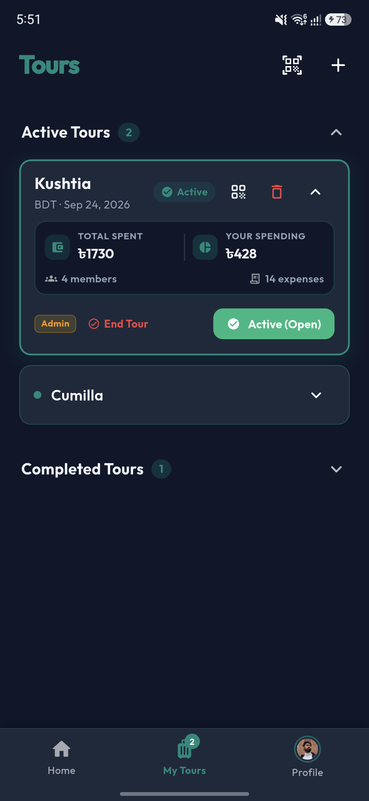
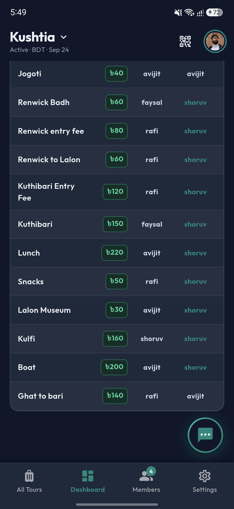
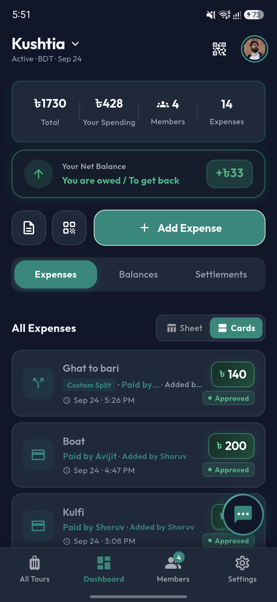
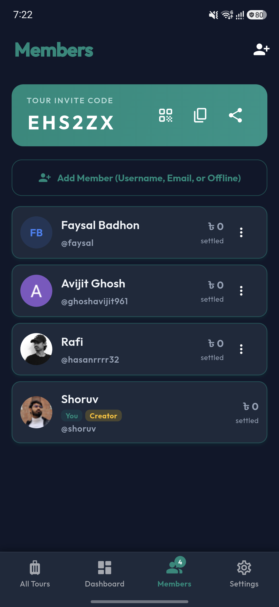
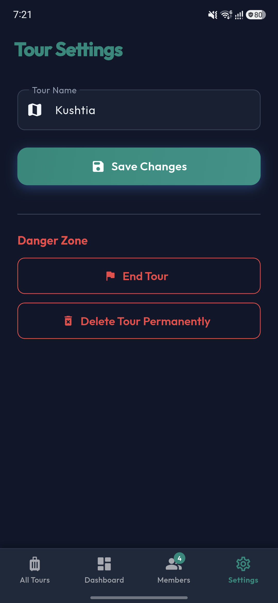

# TourSplit

<div align="center">

[](https://github.com/shoruvx/TourSplit/releases)
[](https://flutter.dev)
[](https://firebase.google.com)
[](https://github.com/shoruvx/TourSplit/releases)
[](LICENSE)

**Split the costs, keep the memories.**

A smart, real-time travel expense tracker, debt settlement, and hybrid collaboration application built for real trips with real people.

[Download Latest APK](https://github.com/shoruvx/TourSplit/releases/latest) • [Privacy Policy](https://shoruvx.github.io/TourSplit/) • [Report Bug](https://github.com/shoruvx/TourSplit/issues)

</div>

---

## Why TourSplit?

Anyone who has traveled with a group knows the drill: multiple companions pay for cabs, hotel reservations, meals, and emergency snacks. By day three, everyone is stuck in a tangled web of paper receipts, notes, and spreadsheet formulas trying to figure out who owes who.

**TourSplit eliminates the confusion entirely.** Record shared expenses as they occur, compute math formulas directly inside the amount field, collaborate with offline companions even when they do not have the app installed, and let TourSplit calculate the optimal, minimum number of transfers to settle up at the conclusion of your trip.

---

## Screenshots (Live on Device)

<div align="center">

### Modern Interface & Navigation

| Symmetrical Home | Tour Dashboard | Collapsible Tours | Profile & Updates |
|:---:|:---:|:---:|:---:|
|  |  |  |  |

<br/>

### Expense Tracking & Collaboration

| Sheet Attribution | Cards Attribution | Members Management | Streamlined Settings |
|:---:|:---:|:---:|:---:|
|  |  |  |  |

</div>

---

## Features

### Unified Bottom Navigation
- Consistent context-aware bottom navigation bar across Home, My Tours, Tour Dashboard, Members, and Tour Settings.
- Eliminates top bar clutter and redundant back buttons while ensuring smooth, one-tap transitions throughout the application.

### Expense Attribution Tracking
- Automatically records the identity of the member who created each expense entry.
- Displays an immutable "Added" column in the Sheet table and an author badge in Card views, detail sheets, and exported reports to prevent misunderstandings.
- Author attribution is preserved permanently during edits, modifications, and offline syncing.

### Online & Peer-to-Peer Bluetooth Mesh Chat
- Real-time cloud messaging when online, with seamless automatic fallback to peer-to-peer Bluetooth mesh networking when traveling off-grid.
- Long-press interactive reaction bar with aggregate reaction pills and tap-to-toggle counters.
- Quoted message replies and member mentions with autocomplete.
- Silent, resilient Bluetooth connection management with automated reconnection and persistent last-used mode tracking.

### Full Offline Support & Sync Queue
- Local storage caching powered by Hive allows complete app usability without an active internet connection.
- Background offline queue automatically stages expenses, tours, and settlements created offline, syncing them immediately when connectivity is restored.
- Zero data loss or duplicated transactions during transitions between offline and online states.

### Collapsible Tours Hierarchy & Streamlined Settings
- Clean tours view organized into collapsible sections, keeping only your current active tour expanded by default.
- Minimalist tour settings focused strictly on essential configurations, removing unnecessary description fields for a clutter-free experience.
- Safe tour exit options allowing members without recorded expenses to leave completely or preserve mathematical records for shared spending.

### In-Line Math Calculator
- Write math expressions directly into the expense amount field (e.g., `(500 * 2) + 350` or `1200 / 3 + 50`).
- Instant glowing preview chip displays calculated totals in real-time.
- Dedicated mathematical operator bar above the keyboard enables quick arithmetic without switching to external apps.

### Greedy Debt Simplification
- Two-pointer greedy debt reduction algorithm collapses multi-party liabilities into the absolute minimum number of settlement payments.
- Records settlement channels (bKash, Nagad, Cash, Bank Transfer) and maintains an unalterable audit log.

### Offline Companions & Instant Online Migration
- Add travel companions with just their name in seconds, even if they have not installed the app or lack internet access.
- Seamlessly link offline companion profiles to registered user accounts once they join the tour, migrating all historical balances and shared splits with zero data loss.

### Customizable User Profile
- Profile personalization with camera capture, gallery selection, interactive photo cropping, or pre-built travel avatars.
- Updates sync across active tours and member lists instantly.

### PDF Export & Accounting Reports
- Generate itemized accounting reports with a single tap.
- Export ready-to-share summaries of tour statistics, member breakdowns, payer contributions, and final settlement balances.

### Over-The-Air (OTA) Updates & FCM Background Notifications
- In-app version checking with GitHub Releases integration and one-click direct APK downloads.
- High-priority background update notifications via Firebase Cloud Messaging deliver timely notices even when the application is closed.

---

## Quick Start

### 1. Grab the APK
Download the latest Android release from the **[Releases Page](https://github.com/shoruvx/TourSplit/releases/latest)**.

### 2. Sign In
Log in with your Google account or registered email.

### 3. Create or Join a Tour
- **Create Tour**: Specify a tour name, pick trip dates, select a cover theme, and start tracking expenses.
- **Join Tour**: Scan a tour QR code or enter the 6-character tour invite code.

---

## Developer Setup

### Prerequisites
- [Flutter SDK](https://flutter.dev) (v3.3.0 or higher)
- Android SDK (API 34+)
- Firebase Project with Authentication, Cloud Firestore, Firebase Storage, and Cloud Messaging configured

### Getting Started

```bash
# 1. Clone the repository
git clone https://github.com/shoruvx/TourSplit.git
cd TourSplit

# 2. Fetch dependencies
flutter pub get

# 3. Add Firebase configuration
# Place your google-services.json inside android/app/

# 4. Launch on connected device
flutter run
```

### Building Release APK

```bash
flutter build apk --release
# Output: build/app/outputs/flutter-apk/app-release.apk
```

---

## Project Architecture

```
TourSplit/
├── android/                  # Native Android configuration & keystores
├── docs/                     # Live device screenshots & assets
├── lib/
│   ├── core/                 # Design tokens, themes, routing, utilities
│   ├── data/                 # Data layer: models, repositories & services
│   │   ├── models/           # TourModel, ExpenseModel, SettlementModel, UserModel, ChatMessage
│   │   ├── repositories/     # Tour, Expense, Settlement, User, Chat repositories
│   │   └── services/         # Offline queues, Sync, Auth, FCM, App updates
│   ├── presentation/         # Riverpod-powered presentation layer
│   │   ├── auth/             # Login, registration, password reset
│   │   ├── balance/          # Net balance summaries and breakdown
│   │   ├── chat/             # Tour chat, Bluetooth mesh, message reactions
│   │   ├── expense/          # Add/edit expense, Math input, Sheet & Card views
│   │   ├── home/             # Symmetrical home, recent tours
│   │   ├── profile/          # User profile, photo cropping, developer contact
│   │   ├── reports/          # PDF export & itemized accounting summaries
│   │   ├── settlement/       # Greedy settlement engine & payment verification
│   │   ├── tour/             # Tour dashboard, settings, members, joining
│   │   └── widgets/          # Shared design components, badges, bottom navigation
│   └── main.dart             # Application entry point, Hive & Firebase initialization
├── pubspec.yaml              # Package manifest and dependencies
└── README.md                 # Project documentation
```

---

## License

TourSplit is open source under the [MIT License](LICENSE).

<div align="center">

Crafted by **[Constant Time Labs](mailto:talktosrshoruv@gmail.com)** & **[Shoruv](https://github.com/shoruvx)**

</div>
